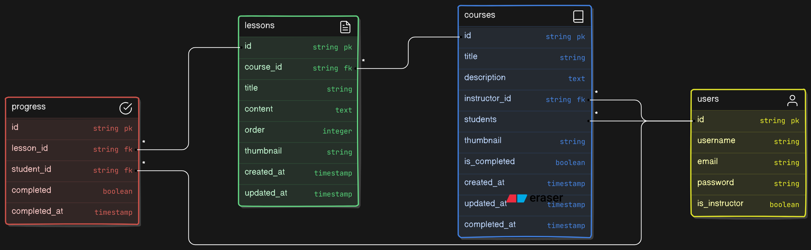

<div align="center">

<h1>Online Learning Platform</h1>

<p>An Online Learning Platform Where Teachers Can Create Different Courses and Students Can Enroll In Different Courses</p>

<br>


</div>


### Table of Contents
1. [Introduction](#introduction)
2. [Setup and Installation](#setup-and-installation)
3. [Configuration](#configuration)
4. [Models](#models)
5. [Forms](#forms)
6. [Views](#views)
    - [Courses Views](#courses-views)
    - [Lessons Views](#lessons-views)
    - [Accounts Views](#accounts-views)
7. [URLs](#urls)
8. [Templates](#templates)
9. [Running the Application](#running-the-application)

### Introduction
This Django application provides functionality for managing courses, lessons, and user accounts (students and instructors). It includes features such as user authentication, course enrollment, and lesson progress tracking.

### Setup and Installation

#### Technology Used

-   **Frontend:** HTML5, CSS3, Bootstrap5
-   **Backend:** Python=3.12.3, Django=5.0.6
-   **Database:** SQLite3
-   **Version Control:** Git, GitHub
-   **Editor:** VS Code
-   **Operating System:** Ubuntu 24.04 LTS
-   **Browser(Tested On):** Google Chrome, Microsoft Edge, Mozilla Firefox


#### Installation Steps
1. **Clone the repository:**
   ```bash
   git clone https://github.com/musfiqdehan/OnlineLearningPlatform.git
   cd your-project
   ```

2. **Create a virtual environment:**
   ```bash
   python -m venv .venv
   source venv/bin/activate  # On Windows use `venv\Scripts\activate`
   ```

3. **Install dependencies:**
   ```bash
   pip install -r requirements.txt
   ```

4. **Run database migrations:**
   ```bash
   python manage.py migrate
   ```

5. **Create a superuser:**
   ```bash
   python manage.py createsuperuser
   ```

6. **Run the development server:**
   ```bash
   python manage.py runserver
   ```

### Configuration
- Ensure your `settings.py` file is configured with your database settings, static and media files settings, and any other necessary configurations.
- Update `INSTALLED_APPS` to include your application.

### Models
The application uses three primary models:

1. **User:** Extends Django's default user model with additional fields for differentiating between students and instructors.
2. **Course:** Represents a course, with fields for the title, description, instructor, and enrolled students.
3. **Lesson:** Represents a lesson within a course, linked to the course it belongs to.
4. **Progress:** Tracks the progress of students through lessons.

- **Entity Relationship among Models:**

<br>



### Forms
The application includes custom forms for user registration:

1. **StudentSignUpForm:** For registering student users.
2. **InstructorSignUpForm:** For registering instructor users.
3. **CourseForm:** For creating and updating courses.
4. **LessonForm:** For creating and updating lessons.

### Views

#### Courses Views
- **Course List View:** Displays a list of all courses.
- **Course Detail View:** Shows details of a specific course, including enrolled students and completed lessons.
- **Course Create View:** Allows instructors to create a new course.
- **Course Update View:** Allows instructors to update an existing course.
- **Course Delete View:** Allows instructors to delete a course.
- **Enroll Course View:** Allows students to enroll in a course.

#### Lessons Views
- **Lesson List View:** Displays a list of lessons for a specific course.
- **Lesson Create View:** Allows instructors to create a new lesson within a course.
- **Lesson Update View:** Allows instructors to update an existing lesson.
- **Lesson Delete View:** Allows instructors to delete a lesson.
- **Lesson Detail View:** Shows details of a specific lesson, including student progress.
- **Mark Lesson Complete View:** Allows students to mark a lesson as completed.

#### Accounts Views
- **Custom Login View:** Custom login view for user authentication.
- **Logout View:** Logs the user out and redirects to the course list.
- **Student Sign Up View:** Allows new students to sign up.
- **Instructor Sign Up View:** Allows new instructors to sign up.

### URLs
The `urls.py` file maps URLs to the appropriate views.

#### Courses URLs
```python
from django.urls import path
from .views import (
    course_list, course_detail, course_create, course_update, course_delete,
    enroll_course, lesson_list, lesson_detail, mark_lesson_complete,
    lesson_create, lesson_update, lesson_delete
)

urlpatterns = [
    path('', course_list, name='course_list'),
    path('course/<int:pk>/', course_detail, name='course_detail'),
    path('course/create/', course_create, name='course_create'),
    path('course/<int:pk>/update/', course_update, name='course_update'),
    path('course/<int:pk>/delete/', course_delete, name='course_delete'),
    path('course/<int:pk>/enroll/', enroll_course, name='enroll_course'),
    path('course/<int:course_pk>/lessons/', lesson_list, name='lesson_list'),
    path('course/<int:course_pk>/lesson/<int:lesson_pk>/', lesson_detail, name='lesson_detail'),
    path('course/<int:course_pk>/lesson/<int:lesson_pk>/complete/', mark_lesson_complete, name='mark_lesson_complete'),
    path('course/<int:course_pk>/lesson/create/', lesson_create, name='lesson_create'),
    path('course/<int:course_pk>/lesson/<int:pk>/update/', lesson_update, name='lesson_update'),
    path('course/<int:course_pk>/lesson/<int:pk>/delete/', lesson_delete, name='lesson_delete'),
]
```

#### Accounts URLs
```python
from django.urls import path
from .views import student_signup, instructor_signup, CustomLoginView, logout_view

urlpatterns = [
    path('signup/student/', student_signup, name='student_signup'),
    path('signup/instructor/', instructor_signup, name='instructor_signup'),
    path('login/', CustomLoginView.as_view(), name='login'),
    path('logout/', logout_view, name='logout'),
]
```

### Templates
The application uses Django templates to render the HTML pages. Ensure you have the following templates:

- `courses/course_list.html`
- `courses/course_detail.html`
- `courses/course_form.html`
- `courses/course_confirm_delete.html`
- `lessons/lesson_list.html`
- `lessons/lesson_detail.html`
- `lessons/lesson_form.html`
- `lessons/lesson_confirm_delete.html`
- `accounts/login.html`
- `accounts/student_signup.html`
- `accounts/instructor_signup.html`

### Running the Application
After completing the setup and configuration, run the development server to start the application:

```bash
python manage.py runserver
```

Visit `http://127.0.0.1:8000/` in your web browser to see the application in action.